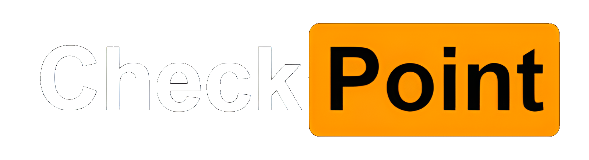
# Introduction
This is the repository for the CNN model created for the mask verify feature for the web application [CheckPoint](https://github.com/dangk4atwit/dangk4atwit.github.io).

The Mask verify feature was meant to help businesses and other establishments help enforce mask regulations. By requiring their employees to submit a mask verification regularly, organizations can expect the spread any air born illnesses to reduce within their establishments.

An Initial model was created for the mask verify feature, but we found that it was overtrained to specific lighting conditions and to specific face types. In hopes of generating a more flexible model, we decided to expand our dataset to a higher variety of images.
# Choosing Datasets
## [Prajnasb Dataset](https://github.com/prajnasb/observations/tree/master/experiements/data)

The Prajnasb dataset contains mask on images that were generated from a face detection model. They detected the face and placed the mask around the mouth and nose area.
### Pros
- lots of image diversity (Sizes, colors, lightings, etc.)
- includes augmented Images
### Cons
- only ~1k Images
- masks are only white
- mask png is not completely accurate to real life
- only masks ON or OFF

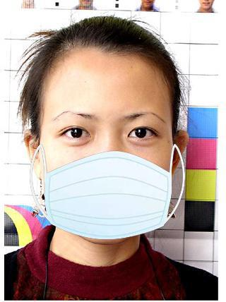
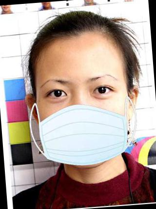

## [Kaggle Dataset](https://www.kaggle.com/datasets/21faa9e463f87c2500de415965f97074cc83502d0f10766fb62a2e1c2bc6b512)

Dataset found from Kaggle with many cropped images of faces and faces from google images.

### Pros
- lots of image diversity (Sizes, colors, lightings, etc.)
- 3k+ Images
- Actually wearing masks
- Different color masks
- Different angles of faces
### Cons
- Majority are closeups
- no augmentation
- Only masks ON or OFF

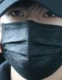
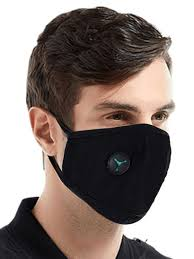
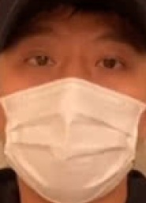
## Custom Generated Datasets

Images of me from different angles and different mask conditions.

### Pros
- Mask position diversity
### Cons
- Lack of diversity
- Only ~100 Images

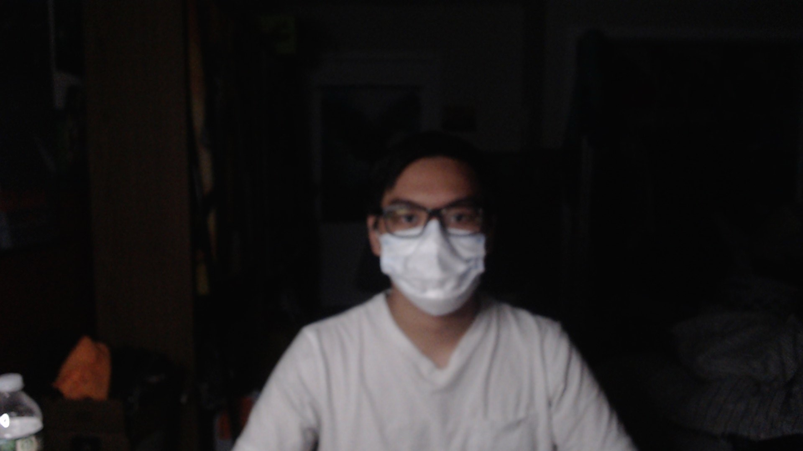
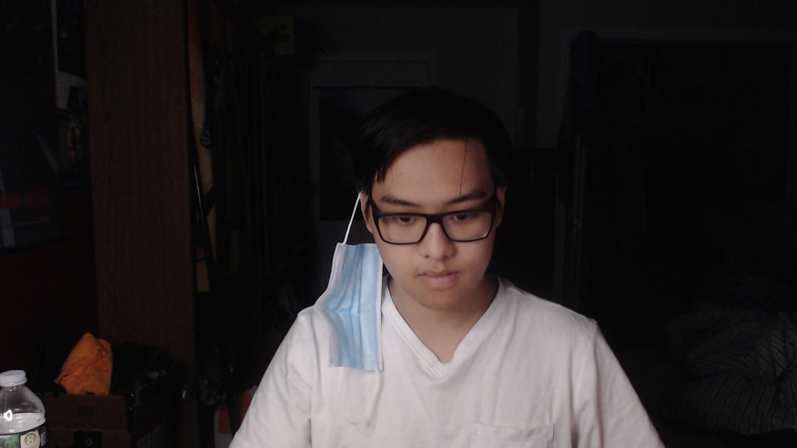
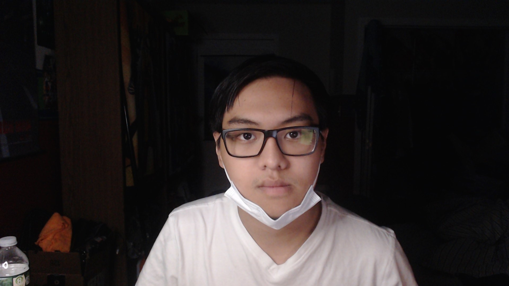

Combining all of these datasets helps us conquer any cons that each of the datasets provided, while giving the model as much diversity as possible. This keeps the model working in diverse conditions for as many people as possible. 
In total there are 4494 with_mask images and 4494 without_mask images. Having them even makes sure the model wont be overtrained towards either side. This is a total of 8988 images for the entire dataset we will be using.

# Data Processing
Due to the file structure of the datasets, we are able to easily read and classify each image according to their location. All mask images are stored within the [with_mask folder](./data/with_mask/) while the no mask images are stored within the [without_mask folder](./data/without_mask/). Images are processed as follows:

The images within the [data folder](./data/) are classified by their sub-folders then read using the [cv2 Library](https://pypi.org/project/opencv-python/). cv2 allows us to resize the image into a 224 x 224 image. We then take the data from the image and convert it into a numpy array. The numpy arrays are then normalized by dividing the pixel values of the image by 255 and reshaped to fit into the CNN model. The final input shape of the images becomes (None, 224, 224, 3). The 224's reflect the pixel dimensions of the image while the 3 represents the RGB color value layers the image contains. Once each image is fully processed and classified, the resulting data is shuffled then stored using [Pickle](https://docs.python.org/3/library/pickle.html). Storing the data allows us to access it on future runnings of our code so that we can save on the time it takes to process all of the images as well as memory.

The complete dataset is split as follows:
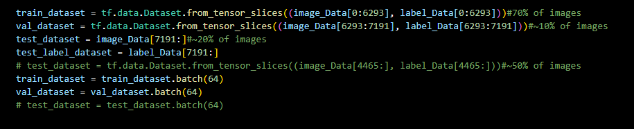

# Methods
### Tools:
- NumPy, Pandas, keras, tensorflow, matplotlib, seaborn for data analysis and inference
- Pickle for data persistence
- Opencv for image processing
- HMTL and CSS for web application design
- Flask for web application framework
- GitHub for version control
- VS Code as IDE 
### CNN methods used with keras:
- Layers: Conv2D, Dense, Dropout, Maxpooling2D
- metrics: Precision (due to prediction issues using accuracy for classification)
- Optimizer: RMSprop (For classification and adjusting learning rate)

# Results
Although our application is not hosted, you can download it from the [CheckPoint Github Page](https://github.com/dangk4atwit/dangk4atwit.github.io). Usage instructions can be found in that readme. 
- User finds themselves not having their mask verify task completed on their dashboard
  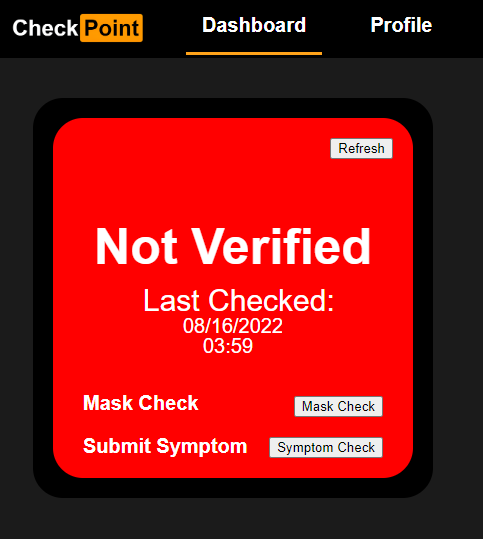
- User goes to mask verify screen to verify their mask status
  - User clicks on submit mask verification to submit their current mask status
  
  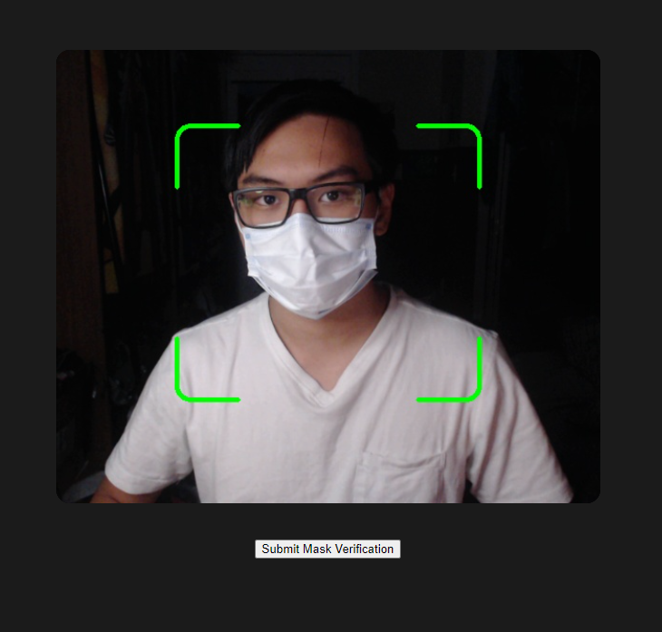
- User submits their mask detected and completes their mask verify task
  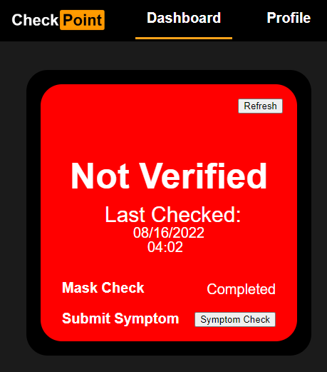

# Discussion

Despite accuracy of the training, validation and test precision of the model (~95%), in practice and use the model seems to still not be as general as we'd like. During usage, lighting and distance play a significant role in if the user us detected wearing a mask. Compared to the older model, there are a lot less false positive for wearing a mask. This is also reflected below:

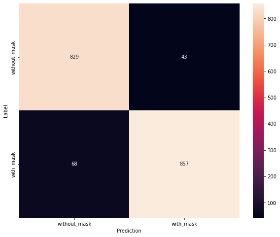
Here we can see that when the model makes a mistake, it is more often that it does not pick up a mask where one exists rather than it detecting a mask where one does not exist. The current model is much more stable and reliable than the previous implementation.

Although other have built similar models, they seemed to have built it with technologies I am unfamiliar with or they did not give access to how they built their model. Their accuracies were high, but I believe most of it is due to how they performed their feature detection and pre-processing. My implementation does not currently have a method of creating bounding boxes around a detected face before predicting mask status.

An other interesting factor when implementing my classification was that when I was using accuracy as my tracking metric, my accuracies would all be ~90%, but the model was unusable for anything outside of the original dataset. It simply always predicted no mask. I am unsure of the cause of this since the training and test dataset are separated before any training occurs so the test dataset should behave like new to the model on prediction. I fear that within the thousands of images, there may be many that are similar in features which is reducing the flexibility of my model. Some research led me to switch to precision and it works, but the switch does not necessarily solve the heart of the issue. I believe increasing sample size and implementing a more proper preprocessing method would prove extremely beneficial for the usage of this model.

# Summary

This project deplays a Convolutional Neural Network model to predict if a person is currently wearing a mask. This is used to help enforce mask regulation is any organization or establishment. After much experimentation, precision hovers around 95%. 

This repository only holds the generation of the model and the data. The full application can be found at https://github.com/dangk4atwit/dangk4atwit.github.io. The repository contains usage instructions in the [README.md](https://github.com/dangk4atwit/dangk4atwit.github.io/blob/main/README.md)

# Sources
- [Initial Inspiration](https://pyimagesearch.com/2020/05/04/covid-19-face-mask-detector-with-opencv-keras-tensorflow-and-deep-learning/)

- [Kaggle Dataset](https://www.kaggle.com/datasets/21faa9e463f87c2500de415965f97074cc83502d0f10766fb62a2e1c2bc6b512)

- [Prajnasb Dataset](https://github.com/prajnasb/observations/tree/master/experiements/data)

# Contributers
- Kevin Dang (dangk4@wit.edu), Creator of old CNN model, Backend Developer
- Johnnie Ho (hoj2@wit.edu), Creator of new CNN model, Fullstack Developer
- Tiffany Nguyen (nguyent63@wit.edu), Project Manager